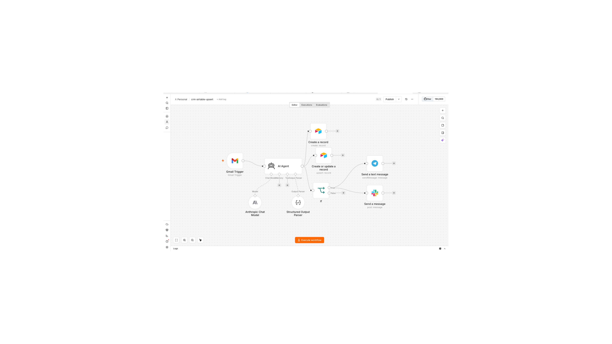

# AI Lead Scoring & CRM Automation (n8n + Claude)

Automatically reads every incoming sales lead email, scores it with AI (**Hot / Warm / Cold**), logs the contact and interaction to Airtable — and instantly alerts the team on **Slack and Telegram** when a hot lead arrives.

Built with [n8n](https://n8n.io) and Claude (Anthropic).

<!-- TODO: add workflow screenshot -->


## The problem this solves

Sales enquiries land in a shared inbox. Someone has to read each one, copy the details into the CRM, judge how serious the lead is, and tell the team. Leads go cold while that happens. This workflow does all of it in seconds, 24/7.

## How it works

```
Gmail Trigger (new email)
        │
        ▼
   AI Agent ──── Anthropic Chat Model (Claude)
        │   └─── Structured Output Parser (enum-locked schema)
        │
        ├──▶ Airtable · Contacts — upsert (matched on Email, no duplicates)
        ├──▶ Airtable · Interactions — append full interaction record
        └──▶ IF leadScore == "Hot"
                  ├──▶ Slack alert (#leads channel)
                  └──▶ Telegram alert
```

1. **Gmail Trigger** fires on every new inbound email.
2. The **AI Agent** (Claude) extracts `name`, `company`, `phone`, writes a one-sentence summary, and assigns a `leadScore`.
3. A **Structured Output Parser** enforces a strict JSON schema — `leadScore` is enum-locked to exactly `Hot | Warm | Cold`, so downstream logic can never receive an unexpected value.
4. Three parallel branches run:
   - **Contacts upsert** in Airtable, matched on the email address — existing contacts are updated, new ones created, never duplicated.
   - **Interactions append** — every email becomes a logged interaction for full history.
   - **Hot-lead check** — an IF node routes hot leads to **both Slack and Telegram** for multi-channel fan-out.

## Design decisions

- **Email as the upsert key, taken from Gmail metadata** (`$('Gmail Trigger').item.json.from.value[0].address`) — never from the AI output. The sender address is ground truth; the AI only extracts what it reads in the message body. This keeps deduplication reliable even if the AI misreads something.
- **Enum-locked lead scoring.** The output parser schema restricts `leadScore` to three exact values. Free-text scores ("pretty hot", "HOT!!") would silently break the IF routing and the Airtable single-select field.
- **Credentials as n8n references only.** This export contains zero tokens or keys — all six credentialed nodes reference credentials stored inside n8n. Safe to publish, safe to import.
- **Parallel branches instead of a chain**, so a failure in one destination (e.g. Slack) doesn't block CRM logging.

## Setup

**You'll need:** an n8n instance (Cloud or self-hosted), a Gmail account (OAuth2), an Anthropic API key, an Airtable base, and optionally Slack + Telegram.

1. Import `crm-airtable-upsert.json` into n8n (Workflow → Import from File).
2. Create/attach your own credentials on each node: Gmail OAuth2, Anthropic, Airtable Personal Access Token, Slack OAuth2, Telegram Bot API.
3. Create an Airtable base with two tables:
   - **Contacts:** `Name`, `Email` (unique), `Phone`, `Company`, `Lead Score` (single select: Hot/Warm/Cold), `Notes`, `Stage`, `Source`
   - **Interactions:** linked `Contact`, channel/summary fields as desired
4. Replace the placeholders: `YOUR_AIRTABLE_BASE_ID`, `YOUR_AIRTABLE_TABLE_ID`, `YOUR_SLACK_CHANNEL_ID`, `YOUR_TELEGRAM_CHAT_ID` (get yours by messaging your bot, then calling the `getUpdates` endpoint).
5. Activate the workflow and send yourself a test lead email.

## Example hot-lead alert

> 🔥 HOT LEAD: Somchai P. from Rayong Dental Group
> 📧 somchai@example.com · 📞 08x-xxx-xxxx
> 📝 Wants pricing for a 12-chair clinic booking system, decision this month.

---

*Part of a series of production-style AI automation projects — more at [github.com/tazahein](https://github.com/tazahein).*
